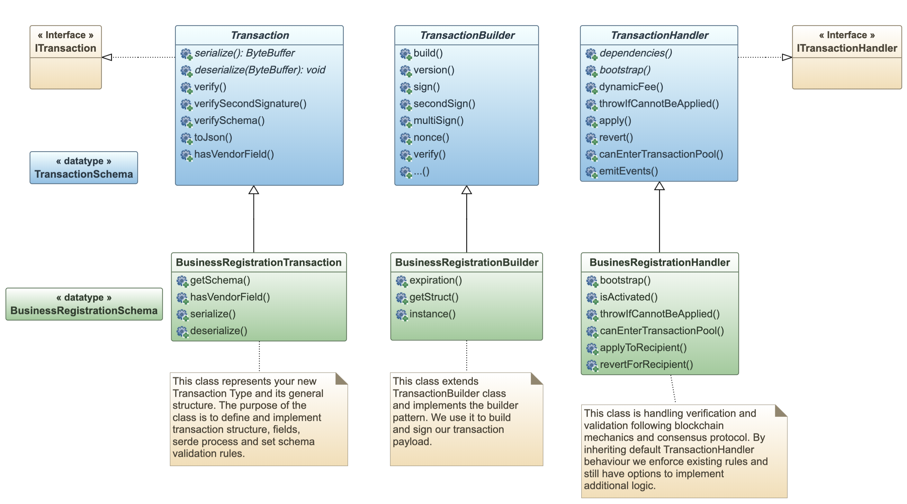

# How To Write New Transactions Types


The GTI engine was initially designed to assist our developers make implementations of new transaction types easier, maintainable, and standardized across the board. **By putting some logic behind custom transaction types, we feel this is a much better and more powerful approach to develop stronger use-cases than with conventional smart contracts.**


Any new implemented Custom Transaction will be packed inside a core module and deployed on the blockchain as a core dApp.

## Technical Overview Of The Core GTI Engine

A general overview of important classes supporting custom transaction development can be seen in the Class Diagram picture below. Abstract classes and methods in the class diagram are presented with _italic_ text_._

To develop a custom transaction type we need to implement code-contracts defined by **GTI interfaces and abstract classes** \(the blue colored items in the class diagram above\). Implementation is pretty straight forward. We override default transaction behaviour and add custom business logic, by implementing the **Transaction**, **Builder** and **Handler** type classes \(the green-colored items in the diagram above\) by following the guides below:











## What Can Be Built With Custom Transactions?

_Most of the real-world interactions are transaction-based/event-based. **Having the ability to add your custom functionality on top of existing distributed ledger technology with ease and reuse its benefits — the possibilities are endless.**_


_We can build_ anything that is done by smart contracts, without the hassle of a complex language such as Solidity or Move!


**For example, we can build:**

* audit log, tracking functionalities \(GDPR, ISO-27001 support by default\),
* supply chain management transactions, e.g. following specific parts through receiving, manufacturing, quality assurance, packaging, distribution, maintenance, and disposal over the entire product life cycle,
* healthcare, e.g. tracking of events, combined with storage of large medical data sets via IPFS network,
* IoT network support, e.g. custom transaction for device registrations and storage of additional sensor data,
* gaming support,
* NFT token support,
* stable coins, 
* administrative role-based system governed by blockchain,
* … and much more — the list is endless.

All of the above-listed examples are transactions in the real world and can be implemented with our core GTI engine. Meaning, as a developer, you can add the new business logic to a blockchain by introducing additional custom transaction types tailored to the application. So, the next thing you need to implement is an awesome front end to support your business. Your new application becomes a light-client by default, leveraging the power of the blockchain platform in the background.


By using **The Core GTI Engine y**ou will be able to follow a streamlined process of creating and securing your new custom transaction type that can be **deployed to any ARK based bridgechain** and managed inside a separate core module \(plugin\).


## How To Access New Transaction Types via Our Public Interfaces

Each newly implemented transaction type becomes a full member of a _core_ node after the registration call — meaning we can query it via existing [Public API interfaces](https://api.ark.dev), after the plugin is deployed on the blockchain.

### **Seamless Integration With ARK Core API And SDKs:**

We provide [different programming language implementations](https://sdk.ark.dev) of our **API**, all accompanied by full cryptography protocol implementation**.** _Simply install the **SDK** of your choice and start interacting with the blockchain_. For more information about our SDKs \(**REST** API and crypto\) refer to [https://sdk.ark.dev](https://sdk.ark.dev).

Use the Builder class to create transaction payloads and send it to the core nodes.

**In the next subsections we will learn how to:**

1. Implement a new transaction type structure
2. Implement a new custom transaction builder class
3. Implement a general transaction handler that hooks our newly created transaction type with the blockchain protocol
4. Use existing API interfaces to interact with core blockchain and new transaction types.

Your newly implemented transaction type can now be packed into a core dApp  and distributed to any ARK technology-based bridgechain \(API and protocol compliant\).


We will explain each of the three class types, **the structure, builder and handler** pattern and their mechanics and purpose in the next sections.


